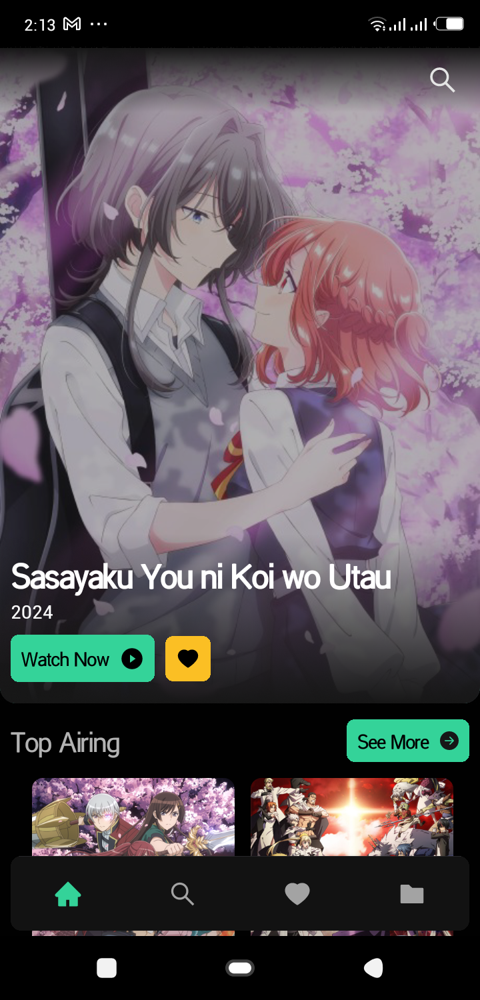
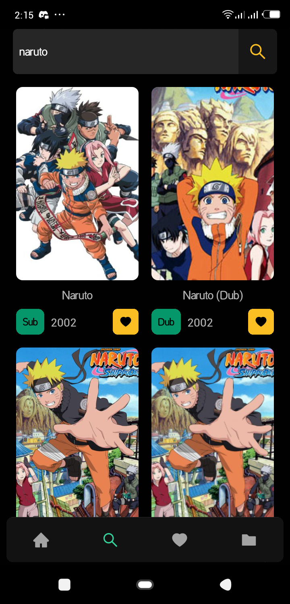
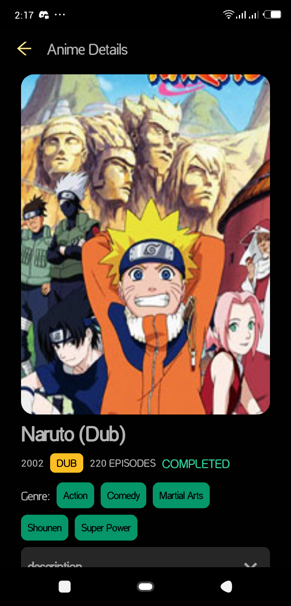
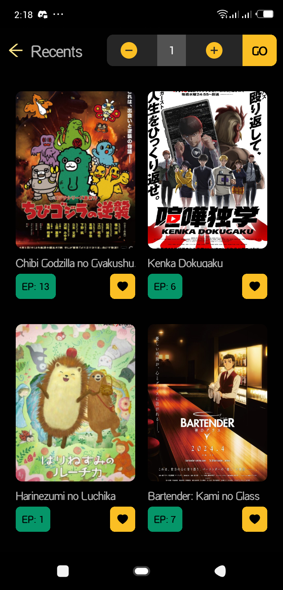
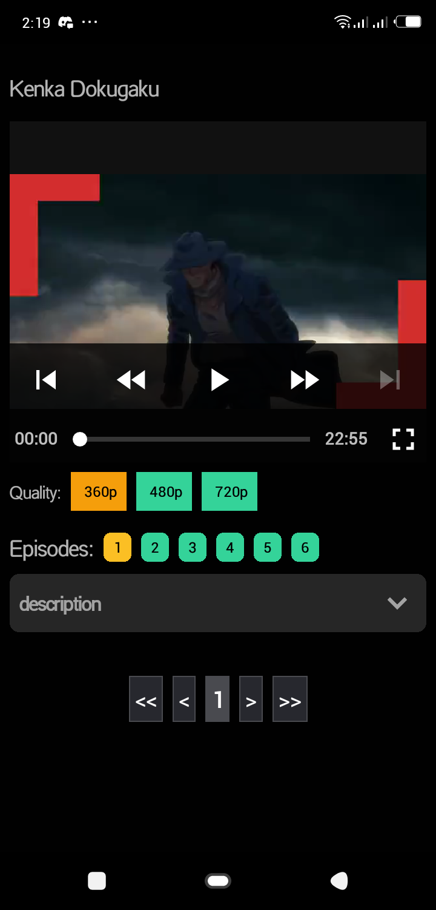

<<<<<<< HEAD
**Gview - Your Anime Companion** 🌟📺

---

**Description:**
Gview is your ultimate anime companion, designed to bring the world of anime to your fingertips. Dive into a vast library of anime titles, explore new releases, and rediscover classics with ease.

---

**Features:**

1. **Search**: Effortlessly find your favorite anime titles or discover new ones by searching through our extensive database. 🔍

2. **Favorites**: Create your personalized collection by marking your favorite anime. Never lose track of the series you love. ❤️

3. **Different Quality**: Enjoy anime in various resolutions to suit your preferences and bandwidth. 🎥

4. **Fast & Responsive**: Experience seamless browsing and smooth navigation with our fast and responsive interface. ⚡

5. **Maintained**: We are committed to providing you with a consistently updated and well-maintained platform, ensuring you always have access to the latest anime content. 🛠️

---

**Downloading**: (Work in Progress) ⚙️

Stay tuned as we work on integrating a downloading feature, allowing you to enjoy your favorite anime offline, anytime, anywhere.

---

**Built with React Native:**

Gview is proudly built using React Native, ensuring a smooth and native-like experience across both iOS and Android platforms.

---

**Screenshots:**


1. **Home Screen:**
   <br>
   
   <br>

2. **Search Screen:**
   <br>
   
   <br>

3. **Info Screen:**
   <br>
   
   <br>

4. **Recent Screen:**
   <br>
   
   <br>

5. **Watch:**
   <br>
   
   <br>
---

**How to Use:**

1. **Search**: Simply type in the name of the anime you're looking for in the search bar at the top of the app interface. Hit enter or tap the search icon to see the results.

2. **Favorites**: To add an anime to your favorites, navigate to the anime's page and click or tap the 'Add to Favorites' button.

3. **Quality Selection**: When streaming an anime, use the quality selector to choose the resolution that best suits your viewing preferences and internet connection speed.

4. **Feedback**: We value your feedback! If you have any suggestions, encounter issues, or want to share your thoughts, feel free to reach out to us through the feedback section in the app settings.

---

**How to Clone and Run:**

To clone and run Gview locally, follow these steps:

1. **Clone the Repository:**

   ```bash
   git clone https://github.com/desto4q/Gview.git
   ```

2. **Navigate to the Project Directory:**

   ```bash
   cd Gview
   ```

3. **Install Dependencies:**

   ```bash
   npm install
   ```

4. **Run the App:**
   ```bash
   npm start
   ```
   This will start the development server. You can then use Expo Go on your mobile device to scan the QR code and open the app.

---

**Downloading from the Release Section:**

If you prefer to download a pre-built version of Gview, you can do so from the Release section of our GitHub repository.

1. **Visit the Repository**: Go to [Gview GitHub Repository](https://github.com/desto4q/Gview).

2. **Navigate to Releases**: Click on the "Releases" tab near the top of the repository.

3. **Download the Latest Release**: Find the latest release version and click on it to expand. You will see download links for the Android (.apk) and iOS (.ipa) versions of the app.

4. **Install the App**: Download the appropriate file for your device and follow the installation instructions for your platform.

---

**Community and Support:**

Join our vibrant community of anime enthusiasts! Connect with fellow users, share your favorite anime recommendations, and stay updated on the latest news and releases.

- **Discord Server**: [Join our Discord community](#) 🌐
- **Twitter**: Follow us on Twitter for news and updates [@GviewAnime](#) 🐦

---

**Contributing:**

We welcome contributions from the community to help make Gview even better! Whether it's through code contributions, bug reporting, or feature suggestions, your input is valuable to us.

- **Contribution Guidelines**: Check out our [contribution guidelines](CONTRIBUTING.md) to get started. 🛠️

---

**Get Started:**

Download Gview now and embark on an anime adventure like never before! 🚀

---

**Note**: Gview is a fan-made app and does not host any of the anime content itself. All content is sourced from legal streaming services and provided for informational purposes only. Please support the official release.

---

**Disclaimer**: Gview does not claim ownership of any anime content. All trademarks and copyrights belong to their respective owners.
=======
This is a new [**React Native**](https://reactnative.dev) project, bootstrapped using [`@react-native-community/cli`](https://github.com/react-native-community/cli).

# Getting Started

>**Note**: Make sure you have completed the [React Native - Environment Setup](https://reactnative.dev/docs/environment-setup) instructions till "Creating a new application" step, before proceeding.

## Step 1: Start the Metro Server

First, you will need to start **Metro**, the JavaScript _bundler_ that ships _with_ React Native.

To start Metro, run the following command from the _root_ of your React Native project:

```bash
# using npm
npm start

# OR using Yarn
yarn start
```

## Step 2: Start your Application

Let Metro Bundler run in its _own_ terminal. Open a _new_ terminal from the _root_ of your React Native project. Run the following command to start your _Android_ or _iOS_ app:

### For Android

```bash
# using npm
npm run android

# OR using Yarn
yarn android
```

### For iOS

```bash
# using npm
npm run ios

# OR using Yarn
yarn ios
```

If everything is set up _correctly_, you should see your new app running in your _Android Emulator_ or _iOS Simulator_ shortly provided you have set up your emulator/simulator correctly.

This is one way to run your app — you can also run it directly from within Android Studio and Xcode respectively.

## Step 3: Modifying your App

Now that you have successfully run the app, let's modify it.

1. Open `App.tsx` in your text editor of choice and edit some lines.
2. For **Android**: Press the <kbd>R</kbd> key twice or select **"Reload"** from the **Developer Menu** (<kbd>Ctrl</kbd> + <kbd>M</kbd> (on Window and Linux) or <kbd>Cmd ⌘</kbd> + <kbd>M</kbd> (on macOS)) to see your changes!

   For **iOS**: Hit <kbd>Cmd ⌘</kbd> + <kbd>R</kbd> in your iOS Simulator to reload the app and see your changes!

## Congratulations! :tada:

You've successfully run and modified your React Native App. :partying_face:

### Now what?

- If you want to add this new React Native code to an existing application, check out the [Integration guide](https://reactnative.dev/docs/integration-with-existing-apps).
- If you're curious to learn more about React Native, check out the [Introduction to React Native](https://reactnative.dev/docs/getting-started).

# Troubleshooting

If you can't get this to work, see the [Troubleshooting](https://reactnative.dev/docs/troubleshooting) page.

# Learn More

To learn more about React Native, take a look at the following resources:

- [React Native Website](https://reactnative.dev) - learn more about React Native.
- [Getting Started](https://reactnative.dev/docs/environment-setup) - an **overview** of React Native and how setup your environment.
- [Learn the Basics](https://reactnative.dev/docs/getting-started) - a **guided tour** of the React Native **basics**.
- [Blog](https://reactnative.dev/blog) - read the latest official React Native **Blog** posts.
- [`@facebook/react-native`](https://github.com/facebook/react-native) - the Open Source; GitHub **repository** for React Native.
>>>>>>> a45f4e2 (Initial commit)
